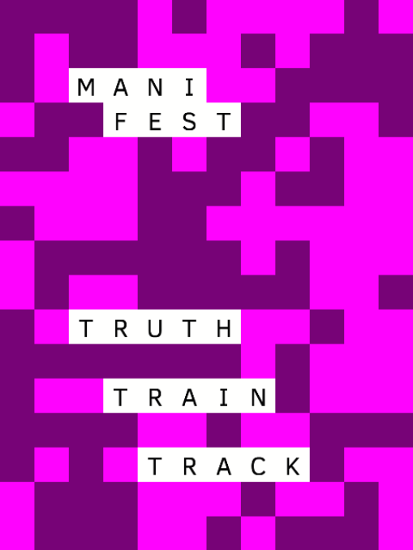
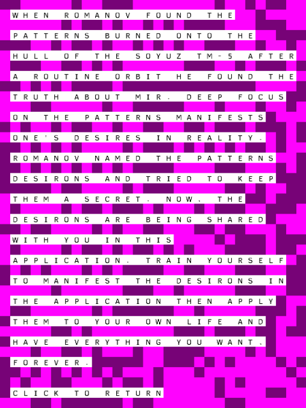
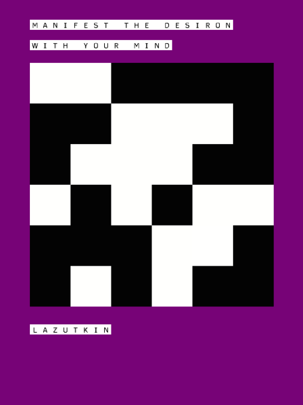
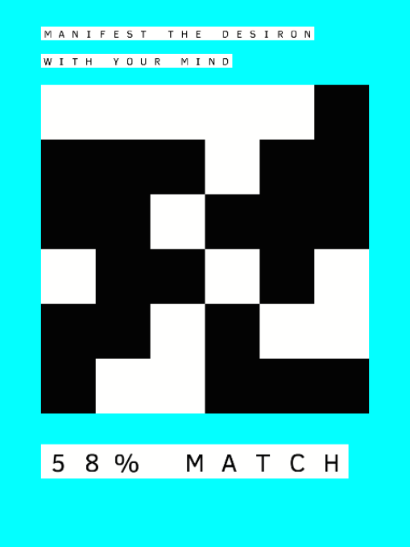
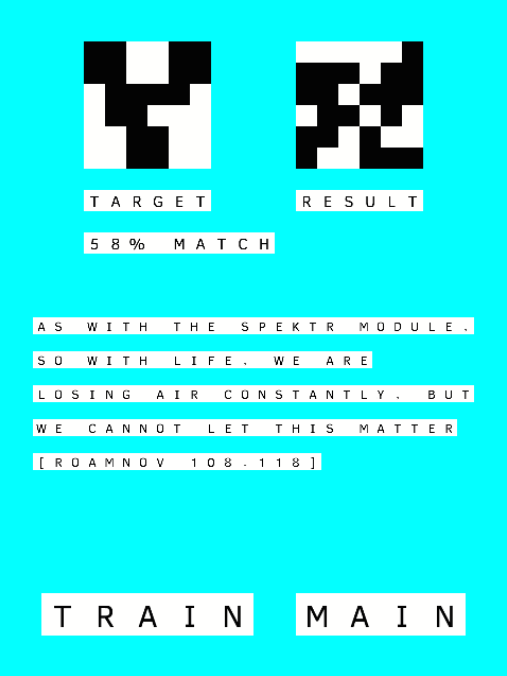
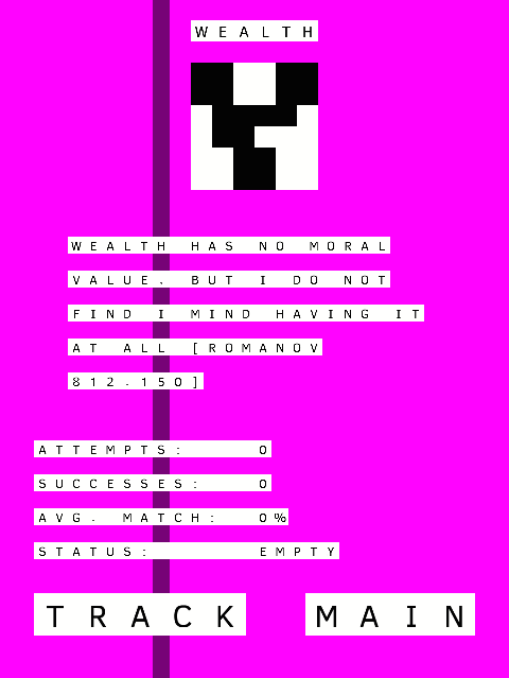

# *MANIFEST* Press Kit

#### [Play Online](https://pippinbarr.github.io/manifest/)

## The basics

* Developer: [Pippin Barr](http://www.pippinbarr.com/)
* Release: 30 September 2014
* Platform: Browser (mobile- and tablet-friendly)
* Code repository: https://www.github.com/pippinbarr/manifest/
* Price: $0.00

## Description
*You can have anything you want! All using the power of your mind! Romanov tried to hide it! But now you’ve got it! Don’t wait! MANIFEST your destiny today!*

When Romanov found the patterns burned onto the hull of the Soyuz TM-5 after a routine orbit he found the truth about Mir. Deep focus on the patterns manifests one's desires in reality. Romanov named the patterns desirons and tried to keep them a secret. Now, the desirons are being shared with you in this application. Train yourself to manifest the desirons in the application then apply them to your own life and have everything you want, forever.

## History
MANIFEST was made for the September 2014 Make Game pageant with a theme of "Magic is Real!" The acronym for "Magic is Real" is MIR. Coincidence? We think not.

## Features
* Self-help.
* Pseudoscience.
* Russian Space Station.
* Ideograms.
* The Truth.
* Everything you have ever wanted, forever.

## Videos

### [MANIFEST Trailer](https://www.youtube.com/watch?v=ICruwsQKdv4)

## Images

## Credits

* Pippin Barr: everything.

## Contact

* Email: [pippin.barr+press@gmail.com](mailto:pippin.barr+press@gmail.com)
* Website: [www.pippinbarr.com](http://www.pippinbarr.com/)
* Twitter: [@pippinbarr](https://www.twitter.com/pippinbarr)
* Facebook: [Pippin Barr](http://www.facebook.com/pippin.barr)
