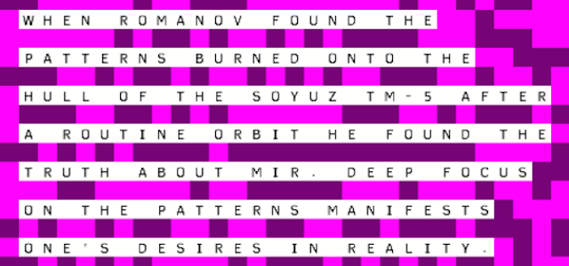

# Blog Posts

Public facing blog post(s) about the game.

## MANIFEST: Manifested (2014-10-04)

I made a game called [MANIFEST](http://www.pippinbarr.com/games/manifest/) over last weekend and Monday and Tuesday as part of the ["Magic is Real" pageant](http://forum.makega.me/category/pageants/spells) on [Make Game](http://makega.me/). My core objective was mostly to make _something_ quickly because I've been drowning a bit in the work required on Jostle Parent, and also partly that I really liked the pageant theme and wanted to force myself to come up with an idea for it.

<!--more-->

So I ended up with a game based on self-help philosophies like _[The Secret](http://en.wikipedia.org/wiki/The_Secret_(book))_ which basically amount to one of the remaining ways in which humans still believe in magical powers. The premise of something like _The Secret_ (and various other related things like the [prosperity gospel](http://en.wikipedia.org/wiki/Prosperity_theology)) is that you just have to think strong, positive thoughts about what you want and... hey presto, you get 'em. I'm quite drawn to how desperate and kind of pathetic-seeming this sort of idea is, it's quite sad, a bit like gambling in some ways. (Of course, I believe in a cold and uncaring universe, so I'm probably coming from a different place to people who are into these things.)

The game started life as a more literal interpretation of the concept called "Give It To Me" that I was going to make for iPhone (before I became kind of disillusioned with iPhone stuff), in which you would express your desire for something by shaking the phone really hard and the game would judge whether you had "wanted it enough" and decree whether or now you were going to get it.

MANIFEST is a take on the same general idea, but layered beneath a weird background story about the [Mir](http://en.wikipedia.org/wiki/Mir) space station. This was essentially just to give some flavour to an otherwise very simple bit of (psychological?) "gameplay" (i.e. willing a symbol to appear on your screen). Still, I really enjoyed the chance to return to some of my (withering) fiction-writing-desires, and particularly liked working within a very emphatically ambiguous context. (I might write a little something else about this fiction stuff, now I think about it, because there's more to say.)

Anyway, the final game is something I'm pretty happy with, especially given the short development time. It works in terms of capturing the "Give It To Me" idea I was excited about sometime last year, and it works in terms of the pageant's theme of "Magic Is Real", and it works on mobile devices, which is something I'm hoping to keep up as much as possible.

(Back to Jostle Parent.)

## MANIFEST fiction (2014-10-08)

One thing I really enjoyed in making [MANIFEST](http://www.pippinbarr.com/manifest/info) was  its relationship to fiction. Initially I wanted to "stick some fiction in it" just to make it less bland, less like it was obviously just a slot machine (the original idea, as I've said before, was pretty much entirely "slot machine for desires"). But of course once you start with fictional stuff, it's always so alluring and fun.

<!--more-->

I think the best choice I made with the game was to keep the fictional stuff as ambiguous as possible. And I mean that in every sense. That is, it's clearly ambiguous to the reader – just little excerpts from a book you never read, mostly – but also to _me_. It's a big time-saver if you don't have to actually _know_ the underlying fiction and thus write "from" it, but rather can just channel a general concept that seems plausible. So having invented "Romanov" and his document about the power of "desirons", I left it at that and just wrote whatever I felt like when it came to quoting the book. I don't know what the book is any more than you do &#8211; I guess it's his diary or something? The point is that it almost doesn't matter because you can fill in the blanks in a way that excites or interests or "does something to you" (even bores you!) as a player.

So it's pleasing to me that that was both powerful from a fictional standpoint (ambiguity's such a winner in terms of "allowing" the reader to do a lot of the interpretive dance, so to speak) but also from a practical standpoint: it was, dear reader, easy. And that's a major concern for me at all times.

Beyond this, though, there's another element that I discussed with Rilla a bit after "releasing" the game, which is the fictional status of the _game itself_. Because the game is presented as a kind of fictional object &#8211; a phone app from a _different world_ than the one we actually inhabit. There's something very nice about that weird status and it seems to me we should be seeing it far more often than we actually appear to? That is, games that aren't just _about_ other places/times, but purport to be _from_ them. (This ties into ideas from design research such as "[speculative design](http://mitpress.mit.edu/books/speculative-everything)" and "[design fiction](http://www.slate.com/blogs/future_tense/2012/03/02/bruce_sterling_on_design_fictions_.html)" that are very interesting in their own right.)

So go make a game from another world, why don't you?

&nbsp;
